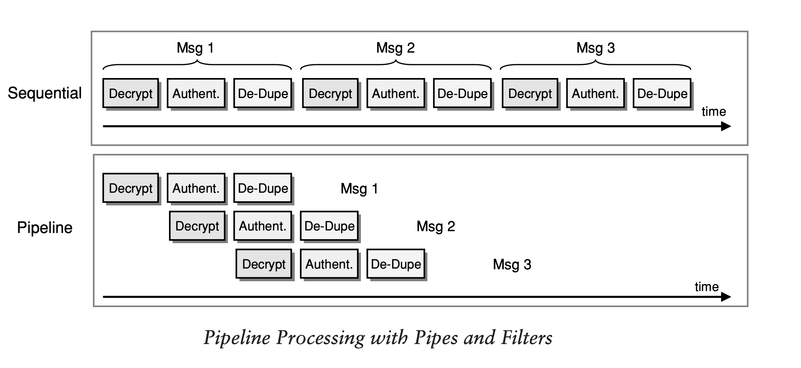

# Reading Task EIP

### Objectives

Message-Oriented Middleware is among the most popular technologies used for connecting
applications. The best practices in implementing messaging systems in enterprise application
integration refer to applying enterprise integration patterns (EIP).

One of the signature readings in this area is the book of Gregor Hohpe and Bobby Woolf "Enterprise Integration Patterns Designing, Building, and Deploying Messaging Solutions".

Your task is to read [Chapter 3: Messaging Systems](https://www.enterpriseintegrationpatterns.com/docs/EnterpriseIntegrationPatterns_HohpeWoolf_ch03.pdf) and create a glossary of at least ten terms, related
to System Integration, which you find essential.

### Glossary

- **Message Channels**
  Channels in this context refers to a virtual pipe that connects a sender to a receiver. Messaging applications transmit data through a Message Channel.

- **Messages**
  A message is an atomic packet/unit of data that can be transmitted on a channel.

- **Pipes and Filters Architectural Style**
  Some actions often need to be performed on the message after it has been sent by its original sender but before it is received by its final receiver. The Pipes and Filters architecture describes how multiple processing steps can be chained together using channels.

  - **Pipes**
    The messaging channels on which the messages are being transmitted.

  - **Filters**
    The different processing steps in a processing task. These steps are connected by pipes.

- **Message Router (Routing)**
  A message may have to go through several channels to reach its final destination. The message can be sent to a Message Router if the route is too complex. This message router is an application component that takes the place of a filter in the Pipes and Filters architecture. The router determines how to navigate the channel topology and directs the message to the final receiver, or at least to the next router.

- **Message Translator (Transformation)**
  A message may need to be transformed during the journey from the sender to the receiver because the sender formats the message one way, but the receiver expects it to be formatted another way. To transform it, the message must go through an intermediate filter, a Message Translator, which converts the message from one format to another.

- **Message Endpoints**
  If an application doesn't have a built-in capability to interface with a messaging system, they need to have a layer of code that knows both how the application words and how the messaging system works, and connect those two, so that they can work together. This code is a set of coordinated message endpoints that enable the application to send and receive messages.

- **Sender & Receiver**
  Two terms which are important to understand when it comes to message systems are 'Sender' & 'Receiver'. There will always be one of each in a message system as a message always _sends_ a message to a message channel which will be _received_ by another application. These terms are also known as 'Publisher and Consumer', 'Listener and Talker' and 'Publisher and Subscriber'.

- **Pipeline Processing**
  Pipeline processing is when multiple messages can be processed concurrently as they pass through individual stages. The image below describes well how a message that has been processed in one stage can be sent directly to the next stage, and each unit can start processing the next message as soon as the first message has been passed on.

  

- **Parallel Processing**
  Parallel Processing is the method of which multiple instances can be run simultaneously to improve the system's throughput. However this configuration can cause messages to be processed out of order, so if the messaging order is critical, only one instance must be run by each component.
